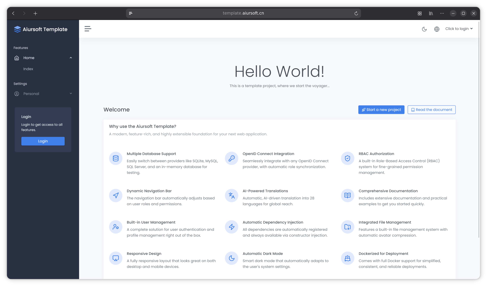

# Template - A sample project

[](https://github.com/aiursoftweb/template/blob/master/LICENSE)
[](https://gitlab.aiursoft.com/aiursoft/template/-/pipelines)
[](https://gitlab.aiursoft.com/aiursoft/template/-/pipelines)
[](https://manhours.aiursoft.com/r/github.com/aiursoftweb/template.html)
[](https://template.aiursoft.com)
[](https://hub.docker.com/r/aiursoft/template)

Template is a sample project.



Default user name is `admin@default.com` and default password is `Admin@123456!`.

## Projects using Aiursoft Template

* [Stathub](https://github.com/aiursoftweb/stathub)
* [MarkToHtml](https://github.com/aiursoftweb/marktohtml)
* [MusicTools](https://github.com/aiursoftweb/musictools)
* [AnduinOS Home](https://github.com/aiursoftweb/AnduinOS-Home)
* [Manhours](https://github.com/aiursoftweb/manhours)
* [Tracer](https://github.com/aiursoftweb/tracer)
* [Warp](https://github.com/aiursoftweb/warp)
* [AiurDrive](https://github.com/aiursoftweb/aiurdrive)
* [EmployeeCenter](https://github.com/aiursoftweb/employeecenter)
* [Git Mirror Server](https://github.com/aiursoftweb/gitmirrorserver)
* [CppRunner](https://github.com/aiursoftweb/cpprunner)
* [Ollama Gateway](https://github.com/aiursoftweb/ollamagateway)
* [Polls](https://github.com/aiursoftweb/polls)
* [WeChatExam](https://github.com/aiursoftweb/wechatexam)
* [MusicExam](https://github.com/aiursoftweb/musicexam)
* [CorpHome](https://github.com/aiursoftweb/corphome)
* [Events Recorder](https://github.com/aiursoftweb/eventsrecorder)
* [Translate](https://github.com/aiursoftweb/translate)
* [Apkg](https://github.com/aiursoftweb/apkg)
* [HowToCook Viewer](https://github.com/aiursoftweb/howtocookviewer)
* [Kanban](https://github.com/aiursoftweb/kanban)
* [MoongladeV2](https://github.com/aiursoftweb/moongladev2)
* [DocsViewer](https://github.com/aiursoftweb/docsviewer)

## Try

Try a running Template [here](https://template.aiursoft.com).

## Run in Ubuntu

The following script will install\update this app on your Ubuntu server. Supports Ubuntu 25.04.

On your Ubuntu server, run the following command:

```bash
curl -sL https://github.com/aiursoftweb/template/raw/master/install.sh | sudo bash
```

Of course it is suggested that append a custom port number to the command:

```bash
curl -sL https://github.com/aiursoftweb/template/raw/master/install.sh | sudo bash -s 8080
```

It will install the app as a systemd service, and start it automatically. Binary files will be located at `/opt/apps`. Service files will be located at `/etc/systemd/system`.

### apt package filesystem layout

When installed via `apt install aiursoft-template`, the following paths are created:

| Role | Path | `apt remove` | `apt purge` |
|------|------|:---:|:---:|
| Working directory & binaries | `/usr/share/aiursoft-template/` | ✓ | ✓ |
| Config file | `/etc/aiursoft-template/appsettings.json` | | ✓ |
| Runtime data (DB, storage, keys) | `/var/lib/aiursoft-template/` | | |
| systemd unit | `/lib/systemd/system/aiursoft-template.service` | ✓ | ✓ |

The config file is a dpkg conffile — kept on `remove`, deleted only on `purge`.
Runtime data under `/var/lib/aiursoft-template/` is user data and intentionally never removed by dpkg.

## Run manually

Requirements about how to run

1. Install [.NET 10 SDK](http://dot.net/) and [Node.js](https://nodejs.org/).
2. Execute `npm install` at `wwwroot` folder to install the dependencies.
3. Execute `dotnet run` to run the app.
4. Use your browser to view [http://localhost:5000](http://localhost:5000).

## Run in Microsoft Visual Studio

1. Open the `.sln` file in the project path.
2. Press `F5` to run the app.

## Run in Docker

First, install Docker [here](https://docs.docker.com/get-docker/).

Then run the following commands in a Linux shell:

```bash
image=aiursoft/template
appName=template
sudo docker pull $image
sudo docker run -d --name $appName --restart unless-stopped -p 5000:5000 -v /var/www/$appName:/data $image
```

That will start a web server at `http://localhost:5000` and you can test the app.

The docker image has the following context:

| Properties  | Value                           |
|-------------|---------------------------------|
| Image       | aiursoft/template               |
| Ports       | 5000                            |
| Binary path | /app                            |
| Data path   | /data                           |
| Config path | /data/appsettings.json          |

## How to contribute

There are many ways to contribute to the project: logging bugs, submitting pull requests, reporting issues, and creating suggestions.

Even if you with push rights on the repository, you should create a personal fork and create feature branches there when you need them. This keeps the main repository clean and your workflow cruft out of sight.

We're also interested in your feedback on the future of this project. You can submit a suggestion or feature request through the issue tracker. To make this process more effective, we're asking that these include more information to help define them more clearly.

## Configuration Guide

The defaults run as a standalone application with SQLite, local accounts, local file storage, and no ClickHouse server. Change a setting only after preparing the dependency named in its comment.

The Docker image copies this file to `/data/appsettings.json` on its first start and keeps that copy on later starts. Mount `/data` as a persistent volume. To override a value without editing the file, use an environment variable with double underscores, such as `Storage__Path` or `AppSettings__OIDC__ClientSecret`.

```jsonc
{
  "ConnectionStrings": {
    // True: cache EF Core query results in this process. False: read from the database on every query.
    "AllowCache": "True",

    // Sqlite: use a local database file and no database server. MySql: use an external MySQL server.
    // When changing this value, also replace DefaultConnection with a connection string for that provider.
    "DbType": "Sqlite",
    // With Sqlite, this creates app.db in the process working directory and applies migrations at startup.
    "DefaultConnection": "DataSource=app.db;Cache=Shared"

    // MySql requires a reachable server, database, user, and password. The application applies migrations at startup.
    // sudo docker run -d --name db -e MYSQL_RANDOM_ROOT_PASSWORD=true -e MYSQL_DATABASE=template -e MYSQL_USER=template -e MYSQL_PASSWORD=template_password -p 3306:3306 hub.aiursoft.com/mysql
    //"DbType": "MySql",
    //"DefaultConnection": "Server=localhost;Database=template;Uid=template;Pwd=template_password;"
  },
  "Storage": {
    // Writable local directory for public Workspace files and token-protected private Vault files.
    // This is not an S3 or MinIO bucket.
    // The Docker image changes /tmp/data to /data; mount /data as a persistent volume in production.
    "Path": "/tmp/data",

    // Optional second hostname for this application's own /download endpoints; this is not an S3 or MinIO URL.
    // Example: set https://files.example.com, point that DNS name to this server, and add this Caddy route:
    // files.example.com {
    //     reverse_proxy 127.0.0.1:5000
    // }
    // Replace 127.0.0.1:5000 with the same upstream used by the web UI. Leave empty to use the UI hostname.
    "PublicOrigin": "",

    // False: verified images and configured media can open on the normal web hostname.
    // True: inline viewing works only through PublicOrigin; the same request on the UI hostname downloads the file.
    // True requires PublicOrigin plus DNS, TLS, and a reverse-proxy route to this same application instance.
    "RequireDedicatedInlineOrigin": false,

    // False: only verified images and SafeInlineMediaExtensions open in the browser; every other file downloads.
    // True: every file type may open through PublicOrigin, and HTML or SVG scripts may run there.
    // True requires RequireDedicatedInlineOrigin=true and a PublicOrigin that receives no application cookies.
    "AllowArbitraryInlineOnDedicatedOrigin": false,

    // File extensions allowed to open after content-signature validation. Empty means no extra audio, video, or SVG.
    // Supported values are mp3, mp4, ogg, svg, wav, and webm. This does not grant upload permission.
    "SafeInlineMediaExtensions": [],

    // SVG opens only when svg is enabled above and its Workspace path starts with an entry in this list.
    // Example: [ "markdown-images" ]. Empty means every SVG downloads.
    "SafeInlineSvgSubfolders": [],

    // These values are copied into newly issued signed upload tokens; existing tokens keep their old policy.
    "UploadPolicy": {
      // False: a valid signed upload token is enough. True: the uploader must also be signed in to this application.
      "RequireAuthenticatedUser": false,

      // False: preserve spaces in uploaded file names. True: save each space as a hyphen.
      "ReplaceSpacesWithHyphens": false
    }
  },
  "AppSettings": {
    // Local: use built-in accounts and passwords. OIDC: redirect sign-in to an external identity provider.
    // OIDC also requires the OIDC section below and a provider callback URL of https://<web-host>/signin-oidc.
    "AuthProvider": "Local",

    // Empty: assign no automatic role. Otherwise, assign this role to every new local or OIDC user.
    // With Local, create the role first. With OIDC, the application creates it during account synchronization.
    "DefaultRole": "",

    // False: sign-in ends when the browser session closes. True: issue a persistent sign-in cookie.
    "PersistsSignIn": false,

    // This section is used only when AuthProvider is OIDC.
    "OIDC": {
      // Provider discovery base URL. It must be reachable by the application and should use HTTPS in production.
      "Authority": "https://auth.aiursoft.com/application/o/template",
      // Client identifier created for this application in the OIDC provider.
      "ClientId": "",
      // Client secret created by the provider. Set AppSettings__OIDC__ClientSecret instead of committing a real secret.
      "ClientSecret": "",

      // Claim containing role names. On every login, local roles are replaced by these roles plus DefaultRole.
      "RolePropertyName": "groups",
      // Required claim used as the local username when an OIDC account is first created.
      "UsernamePropertyName": "preferred_username",
      // Required claim copied to the local display name on every login.
      "UserDisplayNamePropertyName": "name",
      // Required unique email claim. The provider must keep it verified, unique, and stable.
      "EmailPropertyName": "email",
      // Required immutable account identifier. Keep this mapped to the standard OIDC sub claim.
      "UserIdentityPropertyName": "sub"
    },

    // This section is used only when AuthProvider is Local.
    "Local": {
      // True: show self-registration and allow new local accounts. False: existing users can sign in, but cannot register.
      "AllowRegister": true,
      // True: require only six characters. False: require eight characters with upper, lower, digit, and symbol.
      "AllowWeakPassword": true
    }
  },
  "GlobalSettings": {
    // Leave an entry commented to use the database value or built-in default.
    // Uncommenting an entry forces that value and overrides changes made in the administration UI.

    // True: users may change their display nickname. False: only administrators control it.
    // "Allow_User_Adjust_Nickname": "True",
    // Text shown as the brand name in the footer.
    // "BrandName": "Aiursoft",
    // URL opened when a user clicks the footer brand name.
    // "BrandHomeUrl": "https://www.aiursoft.com/",
    // Mainland China ICP license number. Empty hides it.
    // "Icp": "",
    // Application name shown in the web interface.
    // "ProjectName": "Aiursoft Template"
  },
  "Logging": {
    "LogLevel": {
      // Minimum level for application logs. Typical values: Debug, Information, Warning, Error, or None.
      "Default": "Information",
      // Separate minimum level for ASP.NET Core framework logs; Warning reduces routine request noise.
      "Microsoft.AspNetCore": "Warning"
    },
    "Clickhouse": {
      // False: do not send logs to ClickHouse. True: create TableName at startup and send logs in batches.
      // Before enabling, provide a reachable ClickHouse server and valid credentials in ConnectionString.
      "Enabled": false,
      // ClickHouse host, protocol, port, credentials, and database. Used only when Enabled is true.
      "ConnectionString": "Host=localhost;Protocol=http;Port=8123;User=default;Password=;Database=AspNetCoreLogs",
      // ClickHouse table created and used for application logs when Enabled is true.
      "TableName": "TemplateLogs"
    }
  },
  // ASP.NET Core Host-header allowlist; this is not a CORS setting.
  // * accepts every hostname. In production, use semicolon-separated names such as example.com;www.example.com.
  "AllowedHosts": "*"
}
```
